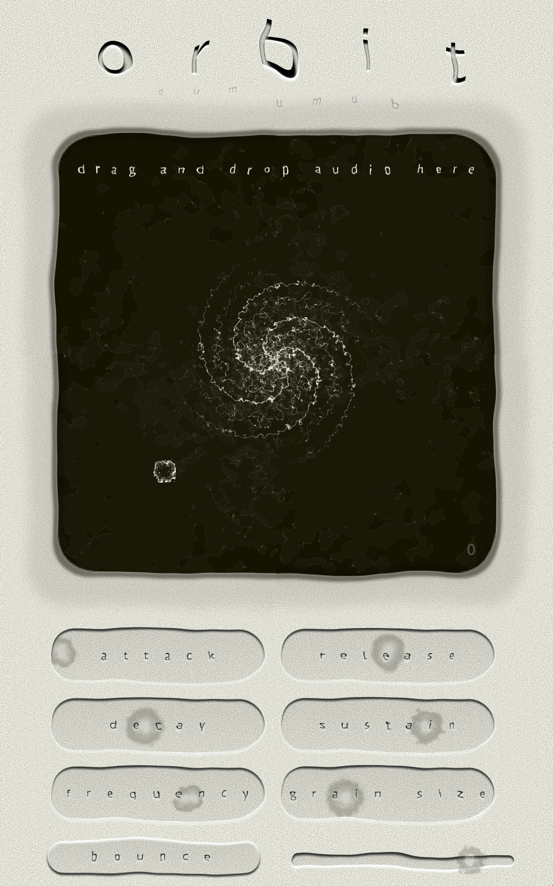
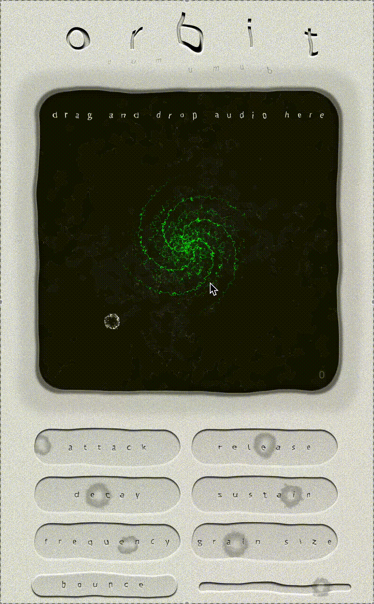
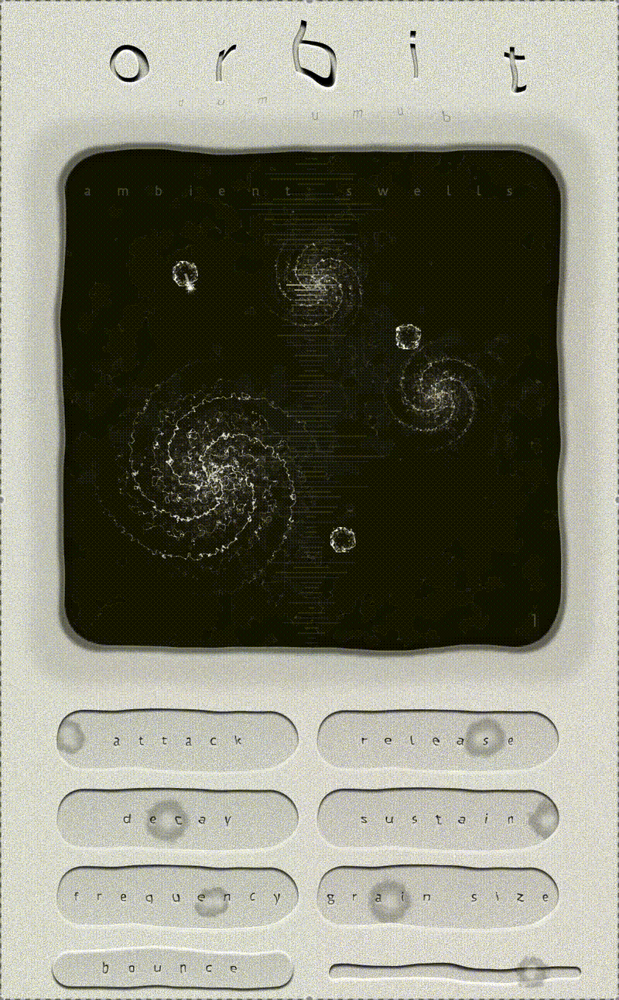
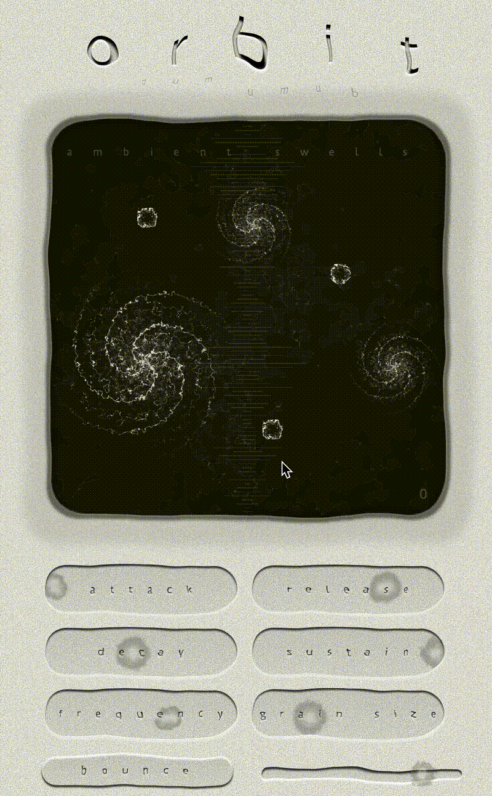
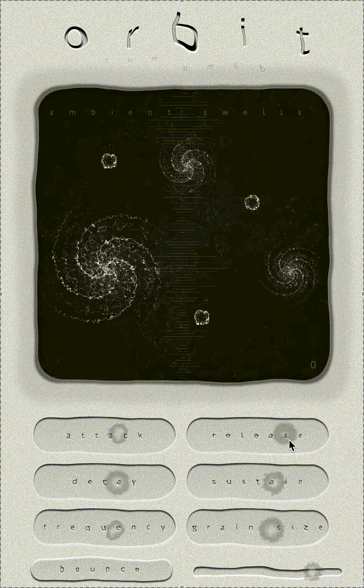
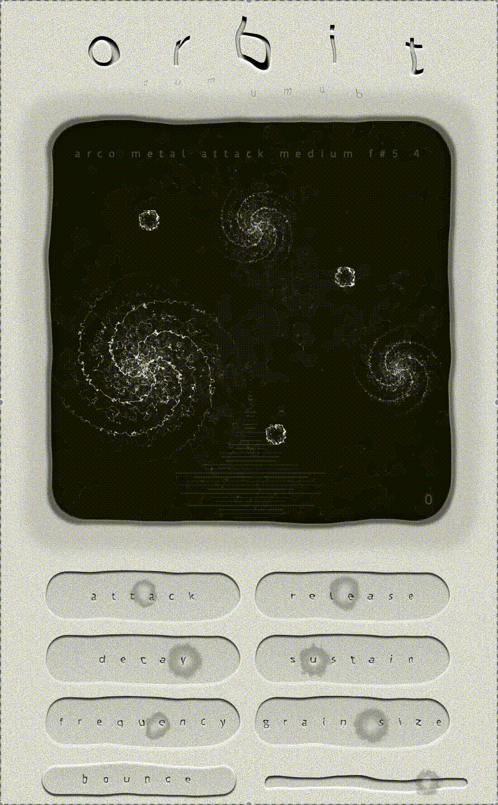

# Orbit - Granular Synthesizer Plugin

A granular synthesizer audio plugin built with JUCE framework, featuring physics-based orbital grain movement, interactive 2D canvas editing, and real-time MIDI-triggered grain emission.

## Plugin Interface

*Granular synthesizer interface with interactive orbital physics canvas*

## Project Overview

Orbit is a granular synthesizer plugin designed for digital audio workstations (DAWs). Grains are spawned via MIDI input and orbit around movable mass points using physics simulation, with their canvas position determining pan and sample playback position in real-time.

**Duration:** August 2025 - February 2026  
**Role:** Solo Developer  
**Technologies:** C++17, JUCE Framework, Granular Synthesis, Physics Simulation, MIDI

## Key Features

### Interactive Orbital Canvas
- **Physics-based Movement** - Grains orbit around mass points using gravitational physics simulation
- **Movable Mass Points** - Drag-and-drop gravity centers with adjustable mass (4 size levels)
- **Multiple Spawn Points** - Up to 8 configurable spawn points with independent momentum arrows
- **Position-based Audio Mapping** - X-axis controls stereo pan, Y-axis controls sample playback position

*Interactive canvas with draggable mass points and spawn points*

*Grains orbiting around mass points with real-time physics simulation*

### MIDI-Triggered Grain Emission
- **Velocity-based Speed** - MIDI velocity controls initial grain orbital velocity
- **Pitch Mapping** - MIDI note number determines grain pitch shift
- **Polyphonic Spawning** - Multiple grains can be active simultaneously (configurable limit)
- **Momentum Arrows** - Draggable arrows on spawn points set initial grain trajectory

*MIDI-triggered grain spawning with velocity-based orbital speed*

*Adjustable momentum arrows controlling initial grain direction*

### Granular Synthesis Engine
- **Grain Size Control** - Adjustable grain duration (10-500ms)
- **Grain Frequency** - Control grain triggering rate for density
- **ADSR Envelope** - Full Attack, Decay, Sustain, Release control per grain
- **Multi-format Support** - Load WAV, MP3, AIFF, FLAC audio files via drag-and-drop

*Real-time ADSR envelope adjustment with visual feedback*

*Drag-and-drop audio file loading with waveform display*

### Canvas Elements
- **Mass Points (Vortex)** - Animated rotating vortex graphics with 4 size states
- **Spawn Points (Spawner)** - Dual-layer rotating spawner graphics with momentum arrows
- **Particle Trails** - Visual trail system showing grain orbital paths
- **Edge Behavior** - Toggle between bounce mode and screen wrapping

*Adjustable mass point sizes affecting gravitational pull strength*

*Toggle between wrap-around and bounce edge behavior*

### Professional UI/UX
- **Custom Graphics** - Hand-designed interface with hover states for all controls
- **Visual Parameter Feedback** - ADSR curve visualization, grain size waveform preview
- **Gain Visualization** - Scaling knob with -infinity dB support
- **Responsive Controls** - Custom slider look-and-feel with rotation animation

*Interactive sliders with visual parameter feedback*
